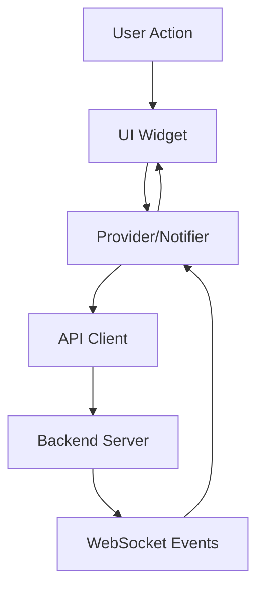

# Design Document

## Overview

本设计文档描述 5SecondsGo App 端功能集成的技术实现方案。主要目标是：
1. 完善路由配置，确保所有页面可访问
2. 新增个人中心和排行榜页面
3. 完善好友功能，集成邀请机制
4. 集成观战和主题功能
5. 统一 UI 风格

## Architecture

### 整体架构

```
app/lib/
├── core/
│   ├── router/
│   │   └── app_router.dart          # 路由配置（需更新）
│   ├── services/
│   │   └── api_client.dart          # API 客户端（需补充排行榜 API）
│   └── theme/
│       └── app_theme.dart           # 主题定义
├── features/
│   ├── profile/                     # 新增：个人中心模块
│   │   ├── presentation/pages/
│   │   │   └── profile_page.dart
│   │   └── providers/
│   │       └── profile_providers.dart
│   ├── leaderboard/                 # 新增：排行榜模块
│   │   ├── presentation/pages/
│   │   │   └── leaderboard_page.dart
│   │   └── providers/
│   │       └── leaderboard_providers.dart
│   ├── friends/                     # 更新：好友模块
│   │   ├── presentation/
│   │   │   ├── pages/
│   │   │   │   ├── friend_list_page.dart    # 需重构 UI
│   │   │   │   └── friend_requests_page.dart
│   │   │   └── widgets/
│   │   │       └── invitation_dialog.dart   # 新增
│   │   └── providers/
│   │       └── friend_providers.dart        # 需补充邀请功能
│   ├── room/                        # 更新：房间模块
│   │   └── presentation/
│   │       └── widgets/
│   │           ├── spectator_controls.dart  # 新增
│   │           └── theme_selector.dart      # 新增
│   └── home/                        # 更新：大厅模块
│       └── presentation/pages/
│           └── home_page.dart               # 需添加观战入口
```

### 数据流



## Components and Interfaces

### 1. Router Configuration

更新 `app_router.dart` 添加缺失路由：

```dart
// 新增路由
GoRoute(path: '/friends', builder: (_, __) => const FriendListPage()),
GoRoute(path: '/friend-requests', builder: (_, __) => const FriendRequestsPage()),
GoRoute(path: '/profile', builder: (_, __) => const ProfilePage()),
GoRoute(path: '/leaderboard', builder: (_, __) => const LeaderboardPage()),
GoRoute(path: '/invite/:code', builder: (_, state) => InviteLinkPage(code: state.pathParameters['code']!)),
```

### 2. Profile Module

#### ProfilePage 组件结构

```dart
class ProfilePage extends ConsumerWidget {
  // 用户信息卡片
  Widget _buildUserInfoCard()
  // 钱包摘要卡片
  Widget _buildWalletSummary()
  // 设置列表
  Widget _buildSettingsList()
  // 登出按钮
  Widget _buildLogoutButton()
}
```

#### ProfileProvider

```dart
class ProfileState {
  final String username;
  final String role;
  final String language;
  final WalletInfo wallet;
}

class ProfileNotifier extends StateNotifier<ProfileState> {
  Future<void> updateLanguage(String lang);
  Future<void> logout();
}
```

### 3. Leaderboard Module

#### LeaderboardPage 组件结构

```dart
class LeaderboardPage extends ConsumerStatefulWidget {
  // Tab 控制器
  TabController _tabController;
  
  // 排行榜类型
  enum LeaderboardType { winRate, totalWins, profit }
  
  // 排行榜列表
  Widget _buildLeaderboardList(LeaderboardType type)
  // 排行榜项
  Widget _buildLeaderboardItem(LeaderboardEntry entry, int rank)
}
```

#### LeaderboardProvider

```dart
class LeaderboardEntry {
  final int userId;
  final String username;
  final double value; // 排名指标值
  final int rank;
}

final leaderboardProvider = FutureProvider.family<List<LeaderboardEntry>, String>((ref, type) async {
  return ref.read(apiClientProvider).getLeaderboard(type);
});
```

### 4. Friends Module Enhancement

#### 邀请对话框

```dart
class InviteFriendDialog extends ConsumerWidget {
  final int roomId;
  
  // 好友列表（可邀请）
  Widget _buildFriendList()
  // 发送邀请
  Future<void> _sendInvitation(int friendId)
}
```

#### 邀请通知处理

```dart
// WebSocket 事件监听
void _handleRoomInvitation(Map<String, dynamic> data) {
  showDialog(
    context: context,
    builder: (_) => InvitationReceivedDialog(
      invitationId: data['invitation_id'],
      roomName: data['room_name'],
      fromUsername: data['from_username'],
    ),
  );
}
```

### 5. Spectator Feature

#### 观战控制组件

```dart
class SpectatorControls extends ConsumerWidget {
  final int roomId;
  final bool canSwitchToParticipant;
  
  Widget build(BuildContext context, WidgetRef ref) {
    return GlassCard(
      child: Column(
        children: [
          Text('观战模式'),
          if (canSwitchToParticipant)
            GradientButton(
              onPressed: () => _switchToParticipant(ref),
              child: Text('切换为参与者'),
            ),
        ],
      ),
    );
  }
}
```

### 6. Theme Feature

#### 主题选择器

```dart
class ThemeSelector extends ConsumerWidget {
  final int roomId;
  
  Widget _buildThemeGrid(List<ThemeInfo> themes)
  Widget _buildThemeCard(ThemeInfo theme, bool isSelected)
  Future<void> _selectTheme(String themeName)
}
```

## Data Models

### LeaderboardEntry

```dart
class LeaderboardEntry {
  final int userId;
  final String username;
  final String? avatarUrl;
  final double value;
  final int rank;
  final bool isCurrentUser;
  
  factory LeaderboardEntry.fromJson(Map<String, dynamic> json);
}
```

### RoomInvitation

```dart
class RoomInvitation {
  final int invitationId;
  final int roomId;
  final String roomName;
  final int fromUserId;
  final String fromUsername;
  final DateTime expiresAt;
  
  factory RoomInvitation.fromJson(Map<String, dynamic> json);
}
```

### ThemeInfo

```dart
class ThemeInfo {
  final String name;
  final String displayName;
  final Color primaryColor;
  final Color backgroundColor;
  final Color accentColor;
  
  factory ThemeInfo.fromJson(Map<String, dynamic> json);
}
```


## Correctness Properties

*A property is a characteristic or behavior that should hold true across all valid executions of a system-essentially, a formal statement about what the system should do. Properties serve as the bridge between human-readable specifications and machine-verifiable correctness guarantees.*

Based on the prework analysis, the following correctness properties have been identified:

### Property 1: Invalid route handling
*For any* invalid route string that does not match defined routes, the router SHALL display the error page and provide navigation back to home.
**Validates: Requirements 1.5**

### Property 2: Language preference persistence
*For any* language preference change, the preference SHALL be persisted to storage and restored correctly on app restart.
**Validates: Requirements 2.4**

### Property 3: Friend search results relevance
*For any* friend search query, all returned results SHALL contain usernames that match the search term (case-insensitive).
**Validates: Requirements 3.5**

### Property 4: Leaderboard entry completeness
*For any* leaderboard entry displayed, the rendered output SHALL contain rank number, username, and the ranking metric value.
**Validates: Requirements 4.3**

### Property 5: Current user leaderboard highlighting
*For any* leaderboard where the current user appears, their entry SHALL be visually distinguished from other entries.
**Validates: Requirements 4.4**

### Property 6: Spectator mode UI constraints
*For any* user in spectator mode, the UI SHALL NOT display betting controls (bet button, amount selector).
**Validates: Requirements 5.3**

### Property 7: Spectator switch button visibility
*For any* spectator in a room, the "switch to participant" button SHALL be visible if and only if the room has available player slots.
**Validates: Requirements 5.4**

### Property 8: Theme color application
*For any* room with a defined theme, the game UI primary and accent colors SHALL match the theme's color definitions.
**Validates: Requirements 7.3**

### Property 9: UI component consistency
*For any* page in the app, the following SHALL hold:
- List items use GlassCard components
- Action buttons use GradientButton components
- Page root uses GradientBackground
- Loading states use shimmer components
- Error states use consistent error card styling
**Validates: Requirements 8.1, 8.2, 8.3, 8.4, 8.5**

## Error Handling

### API Errors
- Network errors: Display retry option with error message
- 401 Unauthorized: Clear auth state, redirect to login
- 404 Not Found: Display "not found" message
- 5xx Server errors: Display generic error with retry

### WebSocket Errors
- Connection lost: Auto-reconnect with exponential backoff
- Invalid message: Log error, ignore message
- Room state desync: Request full state refresh

### Navigation Errors
- Invalid route: Display error page with home navigation
- Missing parameters: Redirect to appropriate fallback page

## Testing Strategy

### Unit Testing
- Test individual provider state transitions
- Test data model serialization/deserialization
- Test utility functions (date formatting, etc.)

### Property-Based Testing
Using `flutter_test` with `dart_quickcheck` or custom generators:

- **Property 1**: Generate random invalid route strings, verify error page displayed
- **Property 2**: Generate random language codes, verify persistence round-trip
- **Property 3**: Generate random search queries and mock friend lists, verify result filtering
- **Property 4-5**: Generate random leaderboard data, verify rendering completeness
- **Property 6-7**: Generate random room states, verify spectator UI constraints
- **Property 8**: Generate random theme configurations, verify color application
- **Property 9**: Render each page type, verify component usage

Each property-based test should run a minimum of 100 iterations.

### Widget Testing
- Test page rendering with mock data
- Test navigation flows
- Test user interactions (tap, scroll, refresh)

### Integration Testing
- Test full user flows (login → home → friends → invite)
- Test WebSocket event handling
- Test deep link handling
